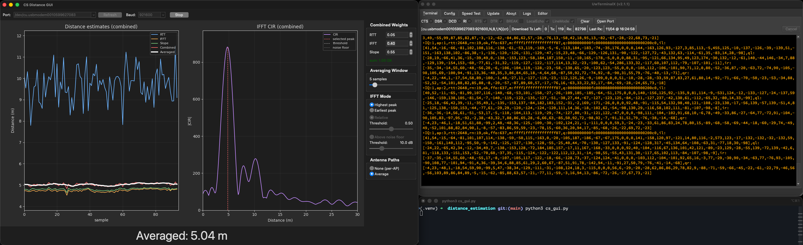
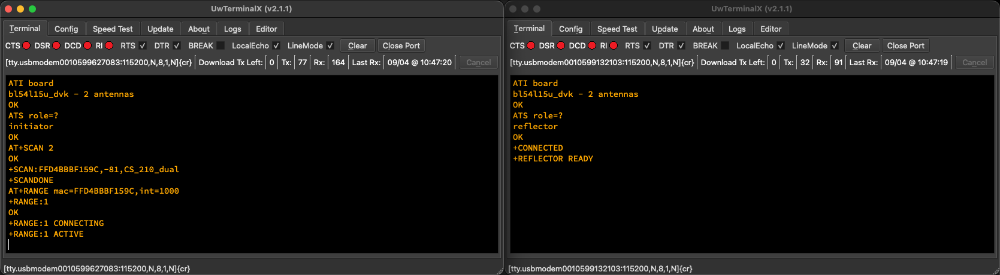
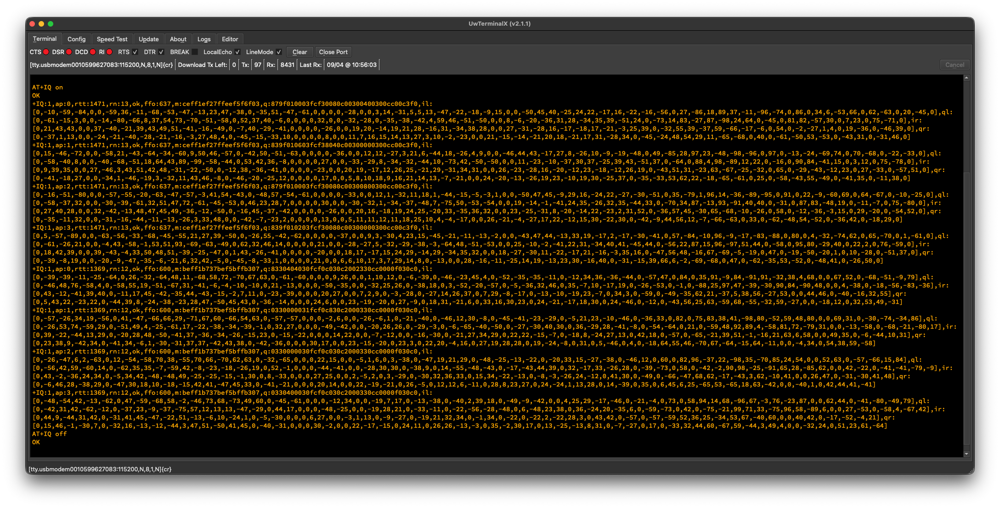
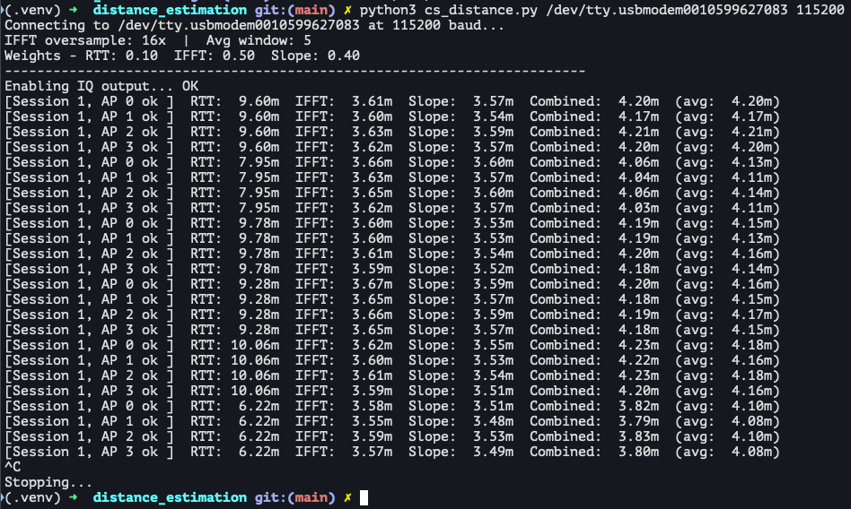
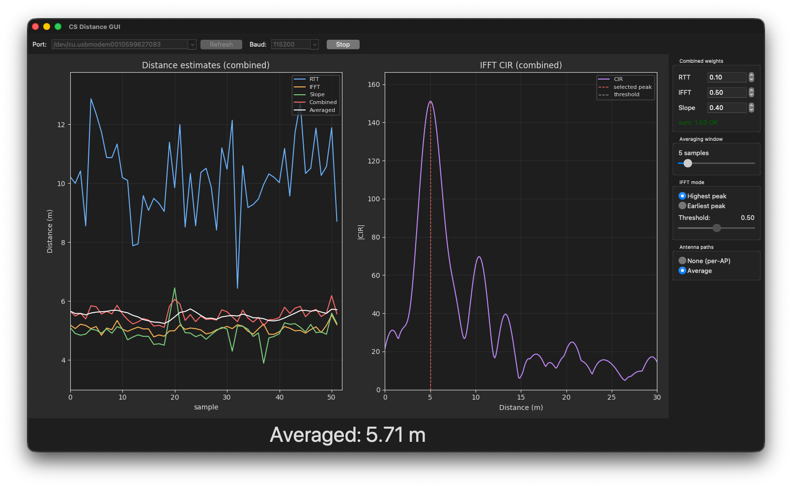

# CS AT Command

A Bluetooth LE Channel Sounding application for the nRF Connect SDK, controlled via AT commands over UART. The application supports both initiator and reflector roles and outputs raw IQ tone data from Channel Sounding procedures, suitable for external distance estimation on a connected host (e.g. a PC).



Built on the Nordic nRF Connect SDK v3.2.4. Targets nRF54L15-based hardware (tested on Ezurio BL54L15 DVK).

## Commands

### General

| Command | Description | Example |
|---------|-------------|---------|
| `AT` | Test command, returns `OK` | `AT` |
| `ATZ` | Software reset | `ATZ` |
| `ATI version` | Show firmware version | `ATI version` |
| `ATI board` | Show board target | `ATI board` |

### Settings (non-volatile)

| Command | Description | Example |
|---------|-------------|---------|
| `ATS role=?` | Query current role | `ATS role=?` -> `role=initiator` |
| `ATS role=<value>` | Set role (`none`, `initiator`, `reflector`) | `ATS role=initiator` |
| `ATS devicename=?` | Query advertised device name | `ATS devicename=?` -> `devicename="CS AT Command"` |
| `ATS devicename=<name>` | Set advertised device name (quotes optional) | `ATS devicename="My Device"` |
| `ATS adv_autostart=?` | Query adv_autostart setting | `ATS adv_autostart=?` -> `adv_autostart=n` |
| `ATS adv_autostart=<y\|n>` | Auto-start advertising on boot (reflector only) | `ATS adv_autostart=y` |
| `ATS conn_int=?` | Query BLE connection interval (ms) | `ATS conn_int=?` -> `conn_int=100` |
| `ATS conn_int=<ms>` | Set BLE connection interval (10-400 ms) | `ATS conn_int=50` |
| `ATS baudrate=?` | Query current UART baudrate | `ATS baudrate=?` -> `baudrate=115200` |
| `ATS baudrate=<num>` | Set UART baudrate (OK sent at old rate before switching) | `ATS baudrate=921600` |

### Scanning (initiator role)

| Command | Description | Example |
|---------|-------------|---------|
| `AT+SCAN` | Scan indefinitely for reflectors advertising the RAS UUID | `AT+SCAN` |
| `AT+SCAN <timeout>` | Scan for `<timeout>` seconds | `AT+SCAN 10` |
| `AT+SCAN stop` | Stop scanning | `AT+SCAN stop` |

Discovered devices are reported as unsolicited responses:
```
+SCAN:AABBCCDDEEFF,-45,CS AT Command
```
Format: `+SCAN:<mac>,<rssi>[,<name>]`. Scanning completion is indicated by `+SCANDONE`.

### Advertising (reflector role)

| Command | Description | Example |
|---------|-------------|---------|
| `AT+ADV start` | Start advertising with RAS UUID | `AT+ADV start` |
| `AT+ADV stop` | Stop advertising | `AT+ADV stop` |

When a remote device connects or disconnects, unsolicited responses are sent:
```
+CONNECTED
+DISCONNECTED
```

Reflector CS setup status is reported via unsolicited responses:
```
+REFLECTOR READY
+REFLECTOR ERROR
+REFLECTOR TIMEOUT
```

If `adv_autostart=y`, advertising restarts automatically after disconnect.

### Ranging (initiator role)

| Command | Description | Example |
|---------|-------------|---------|
| `AT+RANGE mac=<addr>` | Start ranging session (1000 ms default interval) | `AT+RANGE mac=AABBCCDDEEFF` |
| `AT+RANGE mac=<addr>,int=<ms>` | Start ranging session with custom interval | `AT+RANGE mac=AABBCCDDEEFF,int=500` |
| `AT+RANGEX <id>` | Stop a ranging session | `AT+RANGEX 1` |

On success, `AT+RANGE` returns a session ID:
```
+RANGE:1
OK
```

Session status is reported via unsolicited responses:
```
+RANGE:1 CONNECTING
+RANGE:1 ACTIVE
+RANGE:1 DISCONNECTED
+RANGE:1 ERROR
```

### IQ Output Control

| Command | Description | Example |
|---------|-------------|---------|
| `AT+IQ on` | Enable IQ data output over UART | `AT+IQ on` |
| `AT+IQ off` | Disable IQ data output over UART | `AT+IQ off` |
| `AT+IQ ?` | Query current IQ output state | `AT+IQ ?` -> `on` |

IQ output is **off by default**. Enable it before starting a ranging session to receive raw IQ tone data. The setting is not persisted across reboots.

### IQ Data Output

Once IQ output is enabled and a ranging session is active, raw IQ tone data is streamed as unsolicited responses after each Channel Sounding procedure:

```
+IQ:<sid>,ap:<n>,rtt:<half_ns>,rn:<count>,<tq>,ffo:<int|na>,m:<hex>,q:<hex>,il:[...],ql:[...],ir:[...],qr:[...]
```

| Field | Description |
|-------|-------------|
| `sid` | Session ID |
| `ap`  | Antenna path index |
| `rtt` | Accumulated RTT in units of 0.5 ns |
| `rn` | Number of valid RTT measurements |
| `tq` | Aggregate tone quality (`ok` or `bad`) — derived from a count of HIGH-quality tones |
| `ffo` | Per-procedure frequency compensation in 0.01 ppm units (signed, from the controller's mode-0 measurement), or `na` if unavailable |
| `m` | 75-bit per-tone validity bitmap as 20 hex chars (LSB-first within each byte; bit n of byte n/8 = tone n). A bit is set only when a valid PCT was received for that tone. |
| `q` | Per-tone quality codes, 2 bits per tone packed LSB-first as 38 hex chars. Values: `0`=HIGH, `1`=MED, `2`=LOW, `3`=UNAVAILABLE. The worst of (local, peer) is reported. |
| `il` | Local in-phase samples (75 integers, 12-bit signed) |
| `ql` | Local quadrature samples (75 integers) |
| `ir` | Remote in-phase samples (75 integers) |
| `qr` | Remote quadrature samples (75 integers) |

The IQ values are raw 12-bit signed Phase Correction Terms (range -2048 to 2047) across 75 tone channels (CS channels 2-76, i.e. 2404-2478 MHz at 1 MHz spacing). Tones whose corresponding bit in `m` is zero (CS channels not in the channel map, or with PCT marked "not available" by the controller) carry no useful data — receivers should mask them out before any IFFT or phase-slope analysis. The `q` field lets receivers further down-weight or drop LOW-quality tones.

### IQ Output Bandwidth

Each antenna path produces one `+IQ` line. Worst-case line length is **1938 bytes** on the wire (1936 chars + `\r\n`), based on:

- Header (`+IQ:255,ap:255,rtt:-2147483648,rn:255,bad,`): 42 chars
- Frequency compensation (`ffo:-32768,`): 11 chars
- Validity mask (`m:` + 20 hex + `,`): 23 chars
- Tone quality (`q:` + 38 hex + `,`): 41 chars
- 4 IQ arrays x (3 label + 1 `[` + 75 x 5-digit values + 74 commas + 1 `]`): 4 x 454 = 1816 chars
- 3 array separators: 3 chars

The table below shows the maximum number of antenna paths that can be sustained at each baud rate, assuming one CS procedure per second. Multiply the limit proportionally for faster procedure rates (e.g. at 2 procedures/sec, halve the numbers).

| Baud rate | Bytes/sec (8N1) | Max antenna paths/sec | Suitable for |
|-----------|----------------:|----------------------:|--------------|
| 9600      |             960 |                     0 | Not usable for IQ output |
| 19200     |           1,920 |                     0 | Not usable for IQ output |
| 38400     |           3,840 |                     1 | 1 antenna path, 1 proc/sec |
| 57600     |           5,760 |                     2 | 2 paths, or 1 path at 2 proc/sec |
| 115200    |          11,520 |                     5 | 4 paths at 1 proc/sec (default) |
| 230400    |          23,040 |                    11 | 4 paths at up to 2 proc/sec |
| 460800    |          46,080 |                    23 | Multiple sessions, multiple antennas |
| 921600    |          92,160 |                    47 | All configurations with headroom |

The default baudrate is 115200, which supports the common case of a single-antenna initiator and reflector (2 antenna paths per procedure at 1 Hz) with margin. For multi-antenna configurations or higher procedure rates, increase the baudrate with `ATS baudrate=<num>`. The OK response is sent at the old baudrate before the switch takes effect. The setting is persisted across reboots.

Supported baudrates: 9600, 19200, 38400, 57600, 115200, 230400, 460800, 921600.

## Typical Usage

### Reflector

```
ATS role=reflector
OK
ATS devicename="My Reflector"
OK
AT+ADV start
OK
+CONNECTED
+REFLECTOR READY
```

### Initiator

```
ATS role=initiator
OK
AT+SCAN 5
OK
+SCAN:EC3CC2C23110,-42,My Reflector
+SCANDONE
AT+RANGE mac=EC3CC2C23110,int=1000
+RANGE:1
OK
+RANGE:1 CONNECTING
+RANGE:1 ACTIVE
AT+IQ on
OK
+IQ:1,ap:0,rtt:1234,rn:3,ok,ffo:-12,m:fffffe7f3fffffffffff,q:00000000000000000000000000000000000000,il:[45,-102,78,...],ql:[...],ir:[...],qr:[...]
+IQ:1,ap:0,rtt:1180,rn:3,ok,ffo:-12,m:fffffe7f3fffffffffff,q:00000000000000000000000000000000000000,il:[42,-98,80,...],ql:[...],ir:[...],qr:[...]
...
AT+RANGEX 1
OK
```

### Screenshots

Set up initiator and reflector in two serial terminal windows.



Raw IQ output on the initiator terminal (two BL54L15µ Channel Sounding DVKs with dual-antennas).



Distance estimation from cs_distance.py Python script with four antenna paths.



TK GUI front-end cs_gui.py for visualizing distance estimation.



## Connection Interval Tuning

The `conn_int` setting controls the BLE connection interval used for ranging sessions. It directly affects setup speed, ranging throughput, and how many concurrent sessions the radio can sustain.

A shorter connection interval means faster connection setup and security negotiation (each BLE protocol exchange completes in fewer wall-clock seconds) and higher ranging throughput. However, it consumes more radio time per connection, which limits the number of simultaneous sessions.

A longer connection interval frees radio time for additional connections but slows down setup and reduces per-session throughput. With very long intervals, security handshakes (SMP pairing) may approach internal timeouts when multiple connections compete for the radio.

### Recommended values

| Scenario | `conn_int` | Notes |
|----------|-----------|-------|
| Single device, single antenna | 10-30 ms | Fast setup and high throughput |
| Single device, multiple antennas | 30-50 ms | Slightly more radio time per procedure |
| 2 concurrent devices | 50-100 ms | Balances throughput with scheduling headroom |
| 3+ concurrent devices | 200-400 ms | Prevents radio scheduling conflicts |

The default is 100 ms, which works well for typical single-connection setups with up to 2x2 antennas. For 3+ concurrent devices, increase `conn_int` to 200-400 ms to prevent radio scheduling conflicts.

The value must be between 10 and 400 ms and should be a multiple of 1.25 ms (the BLE connection interval unit); non-aligned values are rounded down internally. Changes take effect on the next ranging session without requiring a reset; already-active sessions are not affected.

## Distance Estimation Script

The [distance_estimation/](distance_estimation/) directory contains a Python script that connects to the UART output of an initiator device and computes real-time distance estimates from the raw RTT and IQ data. It combines three independent methods (RTT time-of-flight, IFFT phase-based ranging, and phase slope) with configurable weights and moving-average smoothing.

See [distance_estimation/README.md](distance_estimation/README.md) for installation, usage, and algorithm details.

## Building

```
west build -b <board> -p
```

## Frequently Asked Questions

### From time to time I get a negative phase slope result in the output of cs_distance.py. Is that expected?

Yes, negative phase slope distances can occur and are not unusual. Here's what's happening:

In cs_distance.py:342, the distance is computed as:

`distance = -SPEED_OF_LIGHT * slope / (4.0 * np.pi)`

The leading minus sign accounts for the controller's PCT sign convention, where the CTF phase slope is normally negative for a positive (real) distance. A negative result means the fitted slope came out positive — the "wrong" direction. This can happen due to:

- Phase unwrapping errors — np.unwrap can mistrack when tones are noisy or missing, flipping the apparent slope direction
- Multipath interference — reflections can distort the phase-vs-frequency relationship
- Low SNR / poor tone quality — especially if many tones are masked out (the function requires at least 10 valid tones at line 331, but even 10 can be marginal)

The code already handles this gracefully — in cs_distance.py:391, negative estimates are excluded from the weighted combination:

`if est is not None and est >= 0:`

So negative phase slope values won't corrupt your combined distance. They're essentially a signal that the phase data for that particular measurement was too noisy to produce a reliable result. If you're seeing them frequently, it may point to a challenging RF environment or antenna configuration.

### Why do I get larger (than slope) IFFT values with smaller oversampling (e.g. 1) than with the default of 16?

`--oversample=16`:
`[Session 1, AP 0 ok ]  RTT:  7.83m  IFFT:  3.39m  Slope:  3.23m  Combined:  3.77m  (avg:  4.30m)`

`--oversample=1`:
`[Session 1, AP 0 ok ]  RTT:  6.86m  IFFT:  5.26m  Slope:  3.35m  Combined:  4.66m  (avg:  4.66m)`

This is expected behavior, and here's why: The issue is IFFT bin resolution.

With `NUM_TONES=75` and `FREQ_SPACING=1` MHz:

- oversample=1: n_fft=75. Each bin corresponds to c / (2 * n_fft * Δf) = 3e8 / (2 * 75 * 1e6) = 2.0m per bin. The peak can only land near integer bin positions. Parabolic interpolation helps but can only partially compensate for such a coarse grid. A real ~3.3m distance falls at bin index ~1.65, so the peak snaps toward bin 2 (~4.0m) and parabolic interpolation pulls it partway back, landing around ~5.2-5.5m — exactly what you see.
- oversample=16: n_fft=1200. Each bin is 3e8 / (2 * 1200 * 1e6) = 0.125m. The peak can now land very close to the true distance. Parabolic interpolation on a 0.125m grid resolves sub-decimeter precision, giving you ~3.4m — consistent with the phase slope estimate.

In short: at oversample=1, the distance quantization is ~2m per bin, which is far too coarse for the ~3.3m distances you're measuring. Parabolic interpolation helps but can't fully recover accuracy when the true peak falls between only 2-3 samples. The 16x oversampling provides a sufficiently fine grid that the peak location accurately reflects the true delay.

The phase slope method is unaffected because it fits a line to the unwrapped phase vs. frequency — no FFT grid involved — so it gives the same answer regardless of the --oversample setting.

The default of oversample=16 is a reasonable choice. You could potentially go lower (e.g., 4 or 8) and still get decent results, but oversample=1 is too coarse for accurate IFFT-based ranging at these distances.

# License

MIT License

Copyright (c) 2026 Erik Lins

Permission is hereby granted, free of charge, to any person obtaining a copy
of this software and associated documentation files (the "Software"), to deal
in the Software without restriction, including without limitation the rights
to use, copy, modify, merge, publish, distribute, sublicense, and/or sell
copies of the Software, and to permit persons to whom the Software is
furnished to do so, subject to the following conditions:

The above copyright notice and this permission notice shall be included in all
copies or substantial portions of the Software.

THE SOFTWARE IS PROVIDED "AS IS", WITHOUT WARRANTY OF ANY KIND, EXPRESS OR
IMPLIED, INCLUDING BUT NOT LIMITED TO THE WARRANTIES OF MERCHANTABILITY,
FITNESS FOR A PARTICULAR PURPOSE AND NONINFRINGEMENT. IN NO EVENT SHALL THE
AUTHORS OR COPYRIGHT HOLDERS BE LIABLE FOR ANY CLAIM, DAMAGES OR OTHER
LIABILITY, WHETHER IN AN ACTION OF CONTRACT, TORT OR OTHERWISE, ARISING FROM,
OUT OF OR IN CONNECTION WITH THE SOFTWARE OR THE USE OR OTHER DEALINGS IN THE
SOFTWARE.
